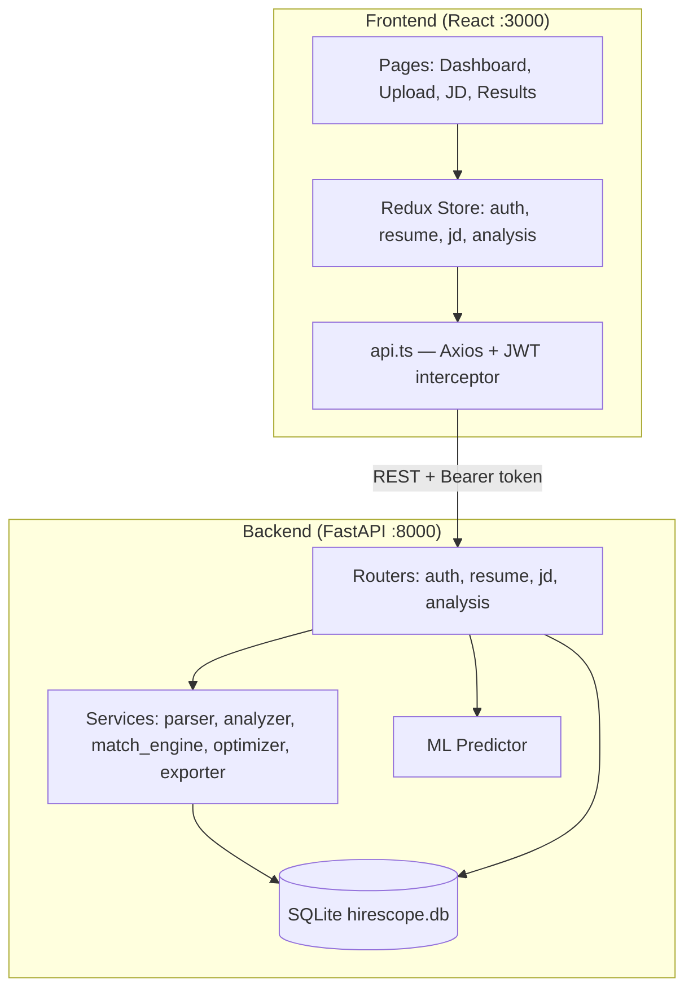

# HireScope — AI Context & Developer Reference

> **Purpose of this document:** This README is written so that any developer or AI assistant can fully understand the HireScope codebase — what each part does, how data flows, and **exactly where to make changes** for a given feature or bug. Read this before modifying the project.

---

## Table of Contents

1. [What HireScope Is](#what-hirescope-is)
2. [High-Level Architecture](#high-level-architecture)
3. [End-to-End User Flow](#end-to-end-user-flow)
4. [Project Structure (Every File Explained)](#project-structure-every-file-explained)
5. [Data Schemas (Critical Contract)](#data-schemas-critical-contract)
6. [Backend Deep Dive](#backend-deep-dive)
7. [Frontend Deep Dive](#frontend-deep-dive)
8. [API Reference](#api-reference)
9. [Scoring & Analysis Logic](#scoring--analysis-logic)
10. [Where to Change What (Change Map)](#where-to-change-what-change-map)
11. [Environment & Running Locally](#environment--running-locally)
12. [Database Schema](#database-schema)
13. [Known Quirks & Gotchas](#known-quirks--gotchas)
14. [Testing](#testing)
15. [Deployment](#deployment)

---

## What HireScope Is

HireScope is a full-stack web app that helps job seekers:

1. **Upload a resume** (PDF/DOCX) and extract structured data (skills, experience, education, projects)
2. **Analyze a job description** (paste text) and extract requirements
3. **Run ATS match analysis** — score how well a resume fits a specific JD
4. **View gap analysis, keyword enhancements, and optimization suggestions**
5. **Download a styled PDF ATS report**

**Important design constraint:** All intelligence is **rule-based + NLP (spaCy) + lightweight ML** — there are **no external LLM API calls**. Parsing, scoring, and suggestions are deterministic.

**Stack:**
| Layer | Technology |
|-------|------------|
| Backend | FastAPI, SQLAlchemy, SQLite, Pydantic v2 |
| NLP | spaCy (`en_core_web_sm`), regex, keyword lists |
| ML | scikit-learn RandomForest (fallback rule-based scoring) |
| Frontend | React 18, TypeScript, Redux Toolkit, Tailwind CSS, React Router |
| Reports | HTML → PDF via `xhtml2pdf` |
| Auth | JWT (python-jose) + bcrypt password hashing |

**Default ports:** Backend `8000`, Frontend `3000`

---

## High-Level Architecture



**Core principle:** Routers are thin (HTTP + DB + auth). Business logic lives in `backend/app/services/`. The match engine is the heart of analysis.

---

## End-to-End User Flow

```
1. Signup/Login
   → POST /api/auth/signup or /api/auth/login
   → JWT stored in localStorage as "token"
   → restoreSession() loads user + resumes + JDs

2. Upload Resume
   → POST /api/resume/upload (multipart file)
   → text_extractor.py extracts raw text
   → resume_parser.py → parsed_data JSON saved to DB

3. Analyze Job Description
   → POST /api/jd/analyze (title, company, content)
   → jd_analyzer.py → parsed_data JSON saved to DB

4. Run Match Analysis (Dashboard → "Run ATS Match Analysis")
   → Navigates to /results/:resumeId/:jdId
   → MatchResults.tsx fires 3 parallel API calls:
       POST /api/analysis/match
       POST /api/analysis/gap-analysis
       POST /api/analysis/optimize
   → Results stored in Redux analysisSlice

5. Download PDF Report
   → POST /api/analysis/report/download
   → ats_report_exporter.py generates PDF blob
```

---

## Project Structure (Every File Explained)

```
hirescope/
├── README.md                          ← THIS FILE — AI/developer reference
├── .env.example                       ← Backend env template
│
├── backend/
│   ├── requirements.txt               ← Python dependencies
│   ├── hirescope.db                   ← SQLite database (created at runtime)
│   └── app/
│       ├── main.py                    ← FastAPI app entry, CORS, router registration
│       │
│       ├── routers/                   ← HTTP layer ONLY — no heavy logic
│       │   ├── auth.py                ← signup, login, /me
│       │   ├── resume.py              ← upload, list, get, delete, versions
│       │   ├── job_description.py     ← analyze JD, list, get, delete
│       │   └── analysis.py            ← match, gap-analysis, optimize, history, PDF download
│       │
│       ├── services/                  ← ALL business logic lives here
│       │   ├── text_extractor.py      ← PDF/DOCX → plain text
│       │   ├── resume_parser.py       ← text → structured resume JSON
│       │   ├── jd_analyzer.py         ← JD text → structured JD JSON
│       │   ├── match_engine.py        ← ★ CORE: ATS scoring, gaps, keyword enhancement
│       │   ├── resume_optimizer.py    ← Rule-based section suggestions
│       │   ├── ats_report_exporter.py ← Match UI → PDF (xhtml2pdf)
│       │   └── docx_exporter.py       ← Legacy DOCX export (not used for reports)
│       │
│       ├── schemas/                   ← Pydantic request/response models
│       │   ├── auth.py
│       │   ├── resume.py
│       │   ├── job_description.py
│       │   └── analysis.py            ← matchResult, GapAnalysisResponse, etc.
│       │
│       ├── models/                    ← SQLAlchemy ORM tables
│       │   ├── user.py
│       │   ├── resume.py              ← Resume + ResumeVersion
│       │   ├── job_description.py
│       │   └── match_result.py        ← class name: matchResult (lowercase m)
│       │
│       ├── database/
│       │   └── session.py             ← engine, SessionLocal, get_db(), Base
│       │
│       ├── ml/
│       │   └── predictor.py           ← ML score (30% weight); rule fallback if untrained
│       │
│       ├── data/
│       │   └── skill_templates.json   ← Bullet templates for resume_optimizer
│       │
│       └── utils/
│           ├── auth.py                ← JWT, bcrypt hash/verify, get_current_user_email
│           ├── exceptions.py          ← ProcessingError
│       │   └── logging.py             ← setup_logging()
│
├── frontend/
│   ├── package.json
│   ├── .env                           ← REACT_APP_API_URL=http://localhost:8000/api
│   └── src/
│       ├── index.tsx                  ← React entry
│       ├── App.tsx                    ← Routes, nav, ProtectedRoute, session restore
│       │
│       ├── pages/
│       │   ├── Login.tsx / Signup.tsx
│       │   ├── Dashboard.tsx          ← Select resume+JD, navigate to results
│       │   ├── ResumeUpload.tsx       ← File upload UI
│       │   ├── JDAnalysis.tsx         ← Paste JD form
│       │   └── MatchResults.tsx       ← ★ Results UI: 5 tabs + PDF download
│       │
│       ├── components/
│       │   ├── ATSScoreCard.tsx       ← Score display card
│       │   ├── SkillBadge.tsx         ← SkillsList pill renderer
│       │   ├── ErrorBanner.tsx
│       │   └── SuccessBanner.tsx
│       │
│       ├── redux/
│       │   ├── store.ts               ← Combines all slices
│       │   └── slices/
│       │       ├── authSlice.ts       ← user, token, isAuthenticated
│       │       ├── resumeSlice.ts     ← resumes list
│       │       ├── jobDescriptionSlice.ts
│       │       └── analysisSlice.ts   ← matchResult, gapAnalysis, optimizationSuggestions
│       │
│       ├── services/
│       │   └── api.ts                 ← All API calls + 401 interceptor
│       │
│       └── hooks/
│           └── useAppInit.ts          ← restoreSession(), loadUserData()
│
├── docker/
│   ├── docker-compose.yml
│   ├── Dockerfile.backend
│   └── Dockerfile.frontend
│
├── docs/
│   ├── DEVELOPMENT_GUIDE.md
│   └── DEPLOYMENT_GUIDE.md
│
└── backend/tests/
    └── test_api.py
```

---

## Data Schemas (Critical Contract)

All matching/analysis reads from **`parsed_data` JSON** stored on `Resume` and `JobDescription` models. If you change parser output shape, you **must** update `match_engine.py` and frontend types.

### Resume `parsed_data` shape

Produced by `ResumeParser.parse_text()` in `resume_parser.py`:

```json
{
  "name": "string | null",
  "email": "string | null",
  "phone": "string | null",
  "linkedin": "string | null",
  "github": "string | null",
  "portfolio": "string | null",
  "summary": "string (max ~500 chars)",
  "skills": [
    { "name": "python", "category": "languages", "frequency": 3 }
  ],
  "experience": [
    {
      "title": "Software Engineer",
      "company": "Acme Corp",
      "duration": "2020 - Present",
      "description": "Built APIs...",
      "skills": ["python", "fastapi"]
    }
  ],
  "education": [
    { "degree": "BS", "field": "Computer Science", "institution": "University", "year": "2020" }
  ],
  "projects": [
    { "title": "Project X", "description": "...", "technologies": ["react", "node"], "url": "..." }
  ],
  "certifications": ["AWS Certified ..."]
}
```

### Job Description `parsed_data` shape

Produced by `JDAnalyzer.analyze_jd()` in `jd_analyzer.py`:

```json
{
  "job_title": "Backend Engineer",
  "company": "Acme",
  "required_skills": ["python", "docker"],
  "preferred_skills": ["kubernetes", "aws"],
  "technical_skills": ["postgresql", "redis"],
  "soft_skills": ["communication", "agile"],
  "responsibilities": ["Design and implement REST APIs", "..."],
  "requirements": ["5+ years experience", "..."],
  "experience_level": "senior | mid | entry | executive | null",
  "years_of_experience": 5,
  "education_requirements": ["Bachelor's in CS or related"],
  "keywords": ["microservices", "ci/cd"]
}
```

**Note:** `years_of_experience` can be `null`. Match engine handles this — do not assume it is always an int.

---

## Backend Deep Dive

### Entry point — `backend/app/main.py`

- Creates FastAPI app with lifespan hook → `Base.metadata.create_all()` on startup
- Registers routers: `auth`, `resume`, `job_description`, `analysis`
- CORS allows `FRONTEND_URL` (default `http://localhost:3000`)
- Health: `GET /health`

### Authentication — `routers/auth.py` + `utils/auth.py`

| Endpoint | Purpose |
|----------|---------|
| `POST /api/auth/signup` | Create user, bcrypt hash password |
| `POST /api/auth/login` | Returns JWT + user object |
| `GET /api/auth/me` | Requires Bearer token |

- Token payload: `{ "sub": "<email>" }`
- Protected routes use `Depends(get_current_user_email)`
- Password hashing uses **bcrypt directly** (not passlib)

### Resume pipeline — `routers/resume.py`

```
UploadFile → ResumeTextExtractor.extract_text() → ResumeParser.parse_text() → DB
```

| File | Role |
|------|------|
| `text_extractor.py` | PDF via pdfplumber/PyPDF2, DOCX via python-docx |
| `resume_parser.py` | spaCy NER + regex section detection + skill keyword DB |

**To improve resume parsing:** edit `resume_parser.py` — especially `SECTION_HEADERS`, `TECHNICAL_SKILLS`, `_extract_experience()`, `_extract_skills()`.

### JD pipeline — `routers/job_description.py`

```
JobDescriptionInput → JDAnalyzer.analyze_jd() → DB
```

**To improve JD extraction:** edit `jd_analyzer.py` — especially `_extract_skills()`, `_extract_responsibilities()`, `_extract_keywords()`, skill keyword lists.

### Analysis pipeline — `routers/analysis.py`

Central orchestrator. Key helper:

```python
def _run_match_analysis(resume, jd) -> dict:
    match_result = ATSMatchEngine().calculate_match(resume.parsed_data, jd.parsed_data)
    ml_score = MLPredictor().predict_score(...)
    final_score = (match_result['ats_score'] * 0.7) + (ml_score * 0.3)  # blended score
    match_result['ats_score'] = final_score
    match_result['report_meta'] = { ... }  # hero score context for UI/PDF
    return match_result
```

| Endpoint | Calls | Returns |
|----------|-------|---------|
| `POST /api/analysis/match` | `_run_match_analysis` + saves summary to `match_results` table | Full `matchResult` schema |
| `POST /api/analysis/gap-analysis` | `calculate_match` + `build_gap_analysis` | `GapAnalysisResponse` |
| `POST /api/analysis/optimize` | `ResumeOptimizer.generate_optimization_suggestions` | `OptimizationResponse` |
| `GET /api/analysis/history` | DB query on `matchResult` | Past match records |
| `POST /api/analysis/report/download` | match + gap + optimize → `ATSReportExporter` | PDF blob |

**Important:** Gap analysis and match endpoints each call `calculate_match()` independently (no shared cache). Changing performance → consider caching parsed match results.

---

### Match Engine — `services/match_engine.py` ★ MOST IMPORTANT FILE

Class: `ATSMatchEngine`

#### Scoring weights (`WEIGHTS`)

| Category | Weight |
|----------|--------|
| Required skills (+ technical) | 40% |
| Preferred skills (+ soft) | 20% |
| Experience | 20% |
| Projects | 10% |
| Education | 10% |

Keyword coverage and responsibility alignment are **computed and returned** but are **not** part of the weighted ATS score formula. They appear as separate metrics in the UI.

#### Main public methods

| Method | Purpose |
|--------|---------|
| `calculate_match(parsed_resume, parsed_jd)` | Full analysis — returns everything for match endpoint |
| `build_gap_analysis(match_result, parsed_resume, parsed_jd)` | Derives gap/priority data from match result |

#### `calculate_match()` output keys

```python
{
  "ats_score": float,                    # before ML blend in router
  "required_skills_match": float,
  "preferred_skills_match": float,
  "experience_match": float,
  "projects_match": float,
  "education_match": float,
  "keyword_coverage": float,
  "responsibility_alignment": float,
  "strengths": [...],                    # categorized strength areas
  "missing_skills": [...],               # with learning resources
  "matched_keywords": [...],
  "missing_keywords": [...],
  "keyword_density": { "python": 3, ... },
  "recommendations": [...],
  "skill_breakdown": { "required": {...}, "preferred": {...} },
  "score_breakdown": [...],              # weighted contribution table
  "experience_analysis": {...},
  "projects_analysis": {...},
  "education_analysis": {...},
  "responsibility_analysis": {...},
  "keyword_analysis": { "coverage_percent", "matched", "missing", "total" },
  "keyword_enhancement": {               # ★ missed keywords + resume-based additions
    "coverage_summary": {...},
    "missing_keywords_detailed": [...],
    "add_to_resume": [...]
  }
}
```

#### Skill matching logic — `_analyze_skill_category()`

For each JD skill:
1. **Exact match** — skill in resume skills set (skills section + exp skills + project tech)
2. **Partial match (60% credit)** — related term in text, alias, or substring match via `_find_partial_evidence()`
3. **Missing** — no match

#### Keyword enhancement — `_build_keyword_enhancement_plan()`

Classifies each JD keyword:
- `matched` — in skills + body, appears 2+ times
- `partial` — related evidence exists
- `hidden` — in body but not skills section
- `underused` — appears only once
- `missing` — not found

Generates `add_to_resume` suggestions with:
- `target_section`, `suggested_phrase`, `evidence_from_resume`, `action_type`

Related term map: `SKILL_RELATED_TERMS` dict at top of file.
Learning resources: `LEARNING_RESOURCES` dict.

**To change scoring:** edit `WEIGHTS`, `_analyze_skill_category()`, or individual `_analyze_*_detailed()` methods.

**To change keyword logic:** edit `_analyze_keyword_coverage()`, `_build_keyword_enhancement_plan()`, `SKILL_RELATED_TERMS`.

**To change recommendations:** edit `_generate_detailed_recommendations()`, `_extract_detailed_strengths()`.

### Resume Optimizer — `services/resume_optimizer.py`

Rule-based suggestions (no LLM). Returns:
- `summary_suggestions`, `experience_suggestions`, `project_suggestions`
- `skills_to_add`, `overall_improvement_potential`

Uses `data/skill_templates.json` for bullet templates.

### PDF Report — `services/ats_report_exporter.py`

- `ATSReportExporter.generate_report()` → bytes
- `_build_html()` mirrors MatchResults UI sections
- `_keyword_enhancement_html()` renders Keywords & Additions section
- `score_verdict(score)` — shared with analysis router

**To change PDF layout/styling:** edit `_build_html()` CSS and section builders in this file.

### ML Predictor — `ml/predictor.py`

- Extracts 10 numeric features from parsed resume + JD
- Model is **not pre-trained** by default → uses `_estimate_score_rules()` fallback
- Blended into final score at 30% weight in `_run_match_analysis()`

**To change ML influence:** edit blend ratio in `analysis.py` `_run_match_analysis()` or train the model via `train_model()`.

---

## Frontend Deep Dive

### Routing — `App.tsx`

| Route | Page | Auth |
|-------|------|------|
| `/` | Dashboard | Protected |
| `/upload` | ResumeUpload | Protected |
| `/analyze-jd` | JDAnalysis | Protected |
| `/results/:resumeId/:jdId` | MatchResults | Protected |
| `/login` | Login | Public (redirects if authed) |
| `/signup` | Signup | Public |

Session restore: on mount, if `isAuthenticated && !user` → `restoreSession(dispatch)`.

### API client — `services/api.ts`

- Base URL: `REACT_APP_API_URL` or `http://localhost:8000/api`
- Attaches `Authorization: Bearer <token>` from localStorage
- 401 interceptor → clears token, redirects to `/login`

All backend calls go through this file. **Add new endpoints here first.**

### Redux state

| Slice | State | Key actions |
|-------|-------|-------------|
| `authSlice` | user, token, isAuthenticated | login, logout, setUser |
| `resumeSlice` | resumes[] | setResumes, addResume |
| `jobDescriptionSlice` | jobDescriptions[] | setJobDescriptions, addJobDescription |
| `analysisSlice` | matchResult, gapAnalysis, optimizationSuggestions | setMatchResult, setGapAnalysis, setOptimizationSuggestions |

### Match Results UI — `pages/MatchResults.tsx`

On mount, fetches 3 endpoints in parallel and dispatches to Redux.

**Tabs:**

| Tab ID | Label | Data source |
|--------|-------|-------------|
| `overview` | Overview | `matchResult` — score breakdown, strengths, recommendations |
| `skills` | Skills Deep Dive | `matchResult.skill_breakdown`, keyword density |
| `keywords` | Keywords & Additions | `matchResult.keyword_enhancement` or `gapAnalysis.keyword_enhancement` |
| `gaps` | Gaps & Priorities | `gapAnalysis` |
| `optimize` | Optimize Resume | `optimizationSuggestions` |

Hero score uses `report_meta.overall_resume_score` (ML-blended) with verdict.

PDF download: `analysisAPI.downloadReport()` → blob → browser download.

**To change results UI:** edit `MatchResults.tsx`. Reusable score cards in `ATSScoreCard.tsx`, skill pills in `SkillBadge.tsx`.

### Data loading — `hooks/useAppInit.ts`

- `restoreSession()` — called after login and on app refresh
- Loads user, resumes, JDs in parallel
- On failure → logout

---

## API Reference

All protected routes require header: `Authorization: Bearer <jwt>`

### Auth — prefix `/api/auth`

| Method | Path | Body | Response |
|--------|------|------|----------|
| POST | `/signup` | `{ email, username, password, first_name?, last_name? }` | UserResponse |
| POST | `/login` | `{ email, password }` | `{ access_token, token_type, user }` |
| GET | `/me` | — | UserResponse |

### Resume — prefix `/api/resume`

| Method | Path | Body | Response |
|--------|------|------|----------|
| POST | `/upload` | multipart `file` (pdf/docx) | ResumeUploadResponse |
| GET | `/list` | — | ResumeResponse[] |
| GET | `/{resume_id}` | — | ResumeResponse |
| GET | `/{resume_id}/versions` | — | ResumeVersionResponse[] |
| DELETE | `/{resume_id}` | — | `{ message }` |

### Job Description — prefix `/api/jd`

| Method | Path | Body | Response |
|--------|------|------|----------|
| POST | `/analyze` | `{ job_title, content, company?, job_url? }` | JobDescriptionResponse |
| GET | `/list` | — | JobDescriptionResponse[] |
| GET | `/{jd_id}` | — | JobDescriptionResponse |
| DELETE | `/{jd_id}` | — | `{ message }` |

### Analysis — prefix `/api/analysis`

| Method | Path | Body | Response |
|--------|------|------|----------|
| POST | `/match` | `{ resume_id, job_description_id }` | matchResult (full) |
| POST | `/gap-analysis` | `{ resume_id, job_description_id }` | GapAnalysisResponse |
| POST | `/optimize` | `{ resume_id, job_description_id }` | OptimizationResponse |
| GET | `/history?limit=20` | — | matchResult[] |
| POST | `/report/download` | `{ resume_id, job_description_id }` | PDF file (blob) |

Interactive docs when running: `http://localhost:8000/docs`

---

## Scoring & Analysis Logic

### Final displayed score

```
rule_score = ATSMatchEngine.calculate_match() → ats_score  (weighted formula)
ml_score   = MLPredictor.predict_score()                   (rule fallback if untrained)
final_score = rule_score * 0.70 + ml_score * 0.30
```

Verdict thresholds (`score_verdict()`):
- ≥80 → "Excellent Match"
- ≥60 → "Good Match"
- ≥40 → "Moderate Match"
- <40 → "Needs Improvement"

### Skill breakdown structure (per required/preferred)

```python
{
  "category": "required" | "preferred",
  "score": 75.0,
  "total": 10,
  "matched_exact": ["python", "sql"],
  "matched_partial": ["kubernetes"],   # 60% credit each
  "missing": ["docker"],
  "match_details": [
    { "skill": "python", "match_type": "exact", "evidence": "Listed in resume skills" },
    { "skill": "kubernetes", "match_type": "partial", "evidence": "Related term found: k8s" }
  ]
}
```

---

## Where to Change What (Change Map)

Use this table when implementing features or fixing bugs.

| I want to… | Primary file(s) | Also check |
|------------|-----------------|------------|
| Fix resume upload / parsing errors | `resume_parser.py`, `text_extractor.py`, `routers/resume.py` | `ResumeUpload.tsx`, file validation |
| Improve JD skill extraction | `jd_analyzer.py` | `match_engine.py` (consumes parsed_data) |
| Change ATS score weights | `match_engine.py` → `WEIGHTS` | UI score breakdown in `MatchResults.tsx` |
| Change final score formula (ML blend) | `routers/analysis.py` → `_run_match_analysis()` | — |
| Add new match metric | `match_engine.py` → `calculate_match()` + `schemas/analysis.py` | `MatchResults.tsx`, `analysisSlice.ts`, `ats_report_exporter.py` |
| Improve keyword / missed keyword analysis | `match_engine.py` → `_build_keyword_enhancement_plan()`, `SKILL_RELATED_TERMS` | `MatchResults.tsx` keywords tab, PDF exporter |
| Change gap analysis output | `match_engine.py` → `build_gap_analysis()` | `schemas/analysis.py`, `MatchResults.tsx` gaps tab |
| Change optimization suggestions | `resume_optimizer.py`, `data/skill_templates.json` | `MatchResults.tsx` optimize tab |
| Change PDF report content/style | `ats_report_exporter.py` | — |
| Add new API endpoint | New route in `routers/*.py`, schema in `schemas/`, call in `api.ts` | Frontend page/component |
| Fix auth / JWT issues | `utils/auth.py`, `routers/auth.py` | `api.ts` interceptor, `authSlice.ts` |
| Fix 401 redirect loop | `api.ts` interceptor, `Login.tsx` | — |
| Add new frontend page | `pages/NewPage.tsx`, route in `App.tsx`, nav link | Redux slice if needed |
| Change DB schema | `models/*.py`, delete/recreate SQLite or add Alembic migration | All queries in routers |
| Add learning resources for skills | `match_engine.py` → `LEARNING_RESOURCES` | — |
| Improve experience years matching | `match_engine.py` → `_analyze_experience_detailed()`, `_parse_duration_years()` | JD `years_of_experience` in `jd_analyzer.py` |
| Fix CORS errors | `main.py` CORS config, `.env` `FRONTEND_URL` | — |
| Change file size limit | `.env` `MAX_FILE_SIZE`, `routers/resume.py` | — |

### Adding a new field to analysis response (checklist)

1. Compute it in `match_engine.py` → `calculate_match()` return dict
2. Add to Pydantic schema in `schemas/analysis.py` → `matchResult` or `GapAnalysisResponse`
3. Add TypeScript type in `analysisSlice.ts`
4. Render in `MatchResults.tsx` (appropriate tab)
5. Add to PDF in `ats_report_exporter.py` if it should appear in reports
6. If persisted: add column to `models/match_result.py` + update `analysis.py` DB save

---

## Environment & Running Locally

### Prerequisites

- Python 3.11+ (project tested on 3.14)
- Node.js 18+
- spaCy model: `python -m spacy download en_core_web_sm`

### Backend

```powershell
cd backend
python -m venv venv
venv\Scripts\activate          # Windows
pip install -r requirements.txt
python -m spacy download en_core_web_sm
copy ..\.env.example .env        # edit SECRET_KEY for production
uvicorn app.main:app --reload --host 0.0.0.0 --port 8000
```

Run from `backend/` directory so SQLite path resolves correctly.

### Frontend

```powershell
cd frontend
npm install
# Create .env with:
# REACT_APP_API_URL=http://localhost:8000/api
npm start
```

Open `http://localhost:3000`

### Environment variables

| Variable | Default | Purpose |
|----------|---------|---------|
| `DATABASE_URL` | `sqlite:///./hirescope.db` | SQLAlchemy connection |
| `SECRET_KEY` | (must change in prod) | JWT signing |
| `FRONTEND_URL` | `http://localhost:3000` | CORS allowed origins |
| `MAX_FILE_SIZE` | `10485760` (10MB) | Resume upload limit |
| `REACT_APP_API_URL` | `http://localhost:8000/api` | Frontend API base |

---

## Database Schema

Tables created automatically on startup via `Base.metadata.create_all()`.

### `users`
`id`, `email`, `username`, `password_hash`, `first_name`, `last_name`, `is_active`, `created_at`, `updated_at`

### `resumes`
`id`, `user_id`, `filename`, `file_path`, `original_content`, `parsed_data` (JSON), `file_type`, `created_at`, `updated_at`

### `resume_versions`
`id`, `resume_id`, `version_number`, `content`, `parsed_data`, `ats_score`, `change_description`, `created_at`

### `job_descriptions`
`id`, `user_id`, `job_title`, `company`, `content`, `parsed_data` (JSON), `job_url`, `created_at`, `updated_at`

### `match_results`
`id`, `user_id`, `resume_id`, `job_description_id`, `ats_score`, `required_skills_match`, `preferred_skills_match`, `experience_match`, `education_match`, `strengths` (JSON), `missing_skills` (JSON), `matched_keywords` (JSON), `keyword_density` (JSON), `recommendations` (JSON), `created_at`, `updated_at`

**Note:** Full analysis payload (skill_breakdown, keyword_enhancement, etc.) is **not** fully persisted — only summary fields. Results page re-computes on each visit.

ORM class for match results is named `matchResult` (lowercase `m`) — intentional but unusual.

---

## Known Quirks & Gotchas

1. **`matchResult` naming** — SQLAlchemy model and Pydantic schema use lowercase `m`. Do not rename without updating all imports.

2. **Analysis re-runs on every results page load** — three API calls recompute match. Scores may vary slightly if ML randomness is introduced later.

3. **ML model is untrained by default** — `MLPredictor.is_trained = False` → rule-based fallback always used for the 30% ML portion.

4. **Gap analysis does not use ML blend** — only `/match` and `/report/download` call `_run_match_analysis()`. Gap endpoint calls raw `calculate_match()` without ML blend.

5. **Windows file MIME types** — frontend validates uploads by file extension, not MIME type (Windows often sends wrong MIME for PDF/DOCX).

6. **spaCy model required** — both parsers fail at startup if `en_core_web_sm` is not installed.

7. **`years_of_experience: null`** — must stay null-safe in match engine (was a past source of 500 errors).

8. **Duplicate DB indexes** — were removed from models; do not re-add duplicate `index=True` on same column.

9. **bcrypt not passlib** — auth uses direct `bcrypt` calls due to passlib/bcrypt 5.x incompatibility.

10. **PDF not DOCX for reports** — `docx_exporter.py` exists but report download uses `ats_report_exporter.py` (PDF).

11. **Resume upload response** — backend returns `resume_id`; frontend maps to `id` when adding to Redux.

---

## Testing

```powershell
# Backend
cd backend
pytest -v tests/

# Frontend
cd frontend
npm test
```

Main test file: `backend/tests/test_api.py`

---

## Deployment

See `docs/DEPLOYMENT_GUIDE.md` and `docker/docker-compose.yml`.

Docker builds:
- `docker/Dockerfile.backend` — FastAPI + spaCy model
- `docker/Dockerfile.frontend` — React production build served via nginx

---

## Quick Reference for AI Assistants

When asked to modify HireScope:

1. **Identify the layer** — Is it parsing, scoring, UI, API, or auth?
2. **Use the [Change Map](#where-to-change-what-change-map)** to find the primary file
3. **Respect `parsed_data` contracts** — resume and JD JSON shapes flow into `match_engine.py`
4. **Match changes across stack** — backend schema → frontend types → UI → PDF if applicable
5. **Do not add LLM calls** — project is intentionally rule/NLP based
6. **Test with** — upload resume → analyze JD → run match → check all 5 result tabs + PDF

**Most common edit target for analysis features:** `backend/app/services/match_engine.py`

**Most common edit target for UI features:** `frontend/src/pages/MatchResults.tsx`

**Most common edit target for new API features:** `backend/app/routers/analysis.py` + `frontend/src/services/api.ts`

---

*HireScope — AI-Powered Resume & Job Description Intelligence Platform*
